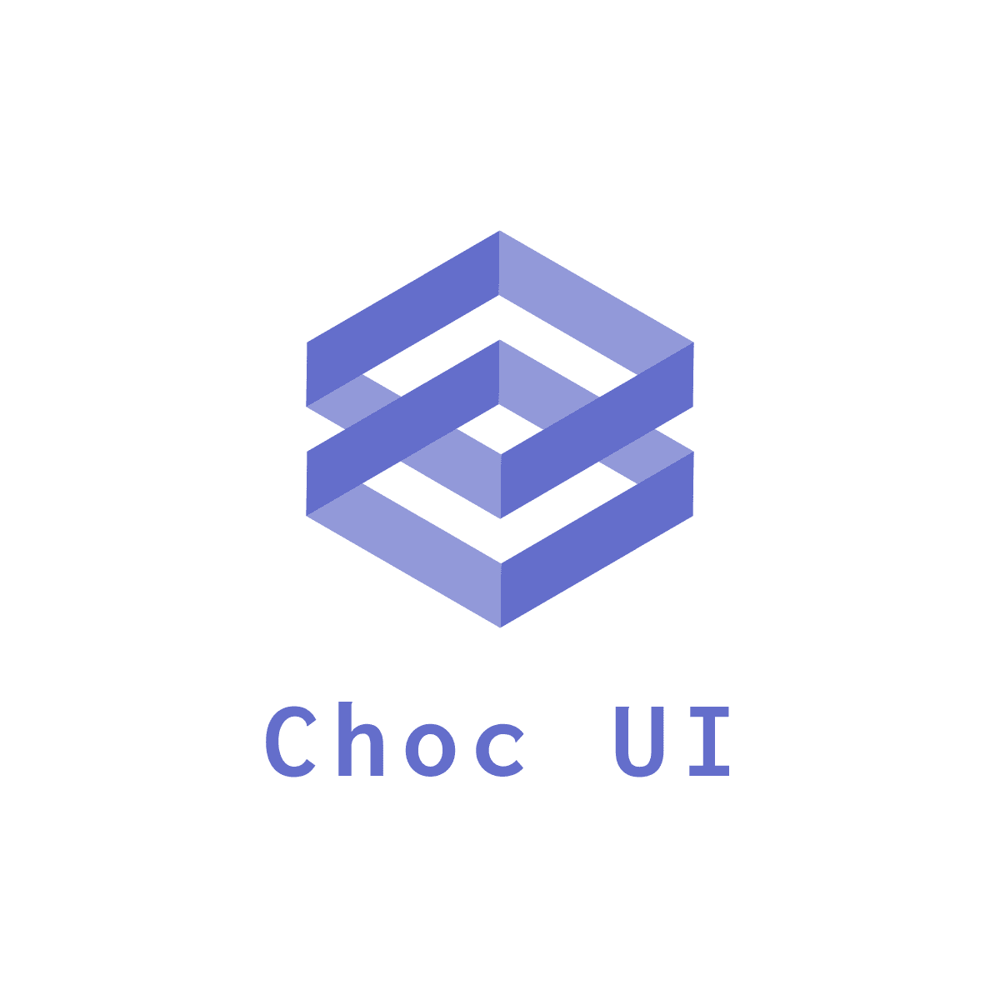

 

## About Choc UI

**CHOC** is _acronym_ for [Chakra](https://chakra-ui.com) Higher Order Components. Choc UI is a collection of components, inspired by many sources of well used web components, which are rebuilt based on the Chakra UI library.

## Components

- [x] Elements
  - [x] Headers
  - [x] Cards
  - [x] Alerts
  - [x] Pagination
  - [x] Badges
  - [ ] Empty - Antd
  - [ ] Result - Antd
  - [ ] Message - Antd
  - [ ] Notification - Antd
- [ ] Page Sections
  - [x] Heros
  - [x] Feature Sections
  - [x] CTA Sections
  - [ ] Pricing Sections
  - [ ] FAQs
  - [ ] Newsletter Sections
  - [ ] Stats
  - [ ] Testimonials
  - [ ] Blog Sections -
  - [ ] Contact Sections
  - [ ] Footers - Meraki UI
  - [ ] Logo Clouds
- [ ] Navigation - TailwindUI
  - [x] Navbars
  - [ ] Vertical Navigation (Menus)
  - [ ] Sidebar Navigation
- [ ] Headings - TailwindUI
  - [ ] Card Headings
  - [ ] Section Headings
  - [ ] Page Headings
- [ ] Example Pages - Meraki UI, Kutty
  - [ ] Login Pages
  - [ ] Registration Pages
  - [ ] Error Pages
- [ ] Application Shells
  - [ ] Sidebar Layouts - Kutty
  - [ ] Page Layouts - Antd
  - [ ] Stacked Layouts - TailwindUI
  - [ ] Multi Column Layouts - TailwindUI

## Contributing

Contributions are what make the open source community such an amazing place to be learn, inspire, and create. Any contributions you make are greatly appreciated. See [Contributing.md](./CONTRIBUTING.md)

## License

Distributed under the MIT License. See [LICENSE](./LICENSE.md) for more information.
